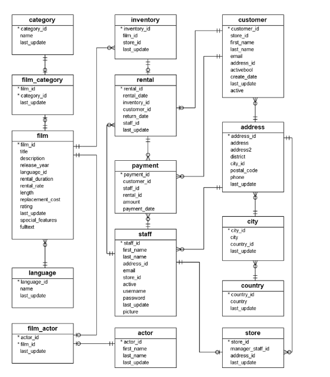

## CUE: FUNDAMENTOS DE BASES DE DATOS RELACIONALES 
### FINAL DRILLING: ARRIENDO DE DVDS

### INSTRUCCIONES 

- Lee con atención cada uno de los requerimientos que se presentan a continuación, y desarrolla 
la prueba de acuerdo con lo solicitado.    

1. Descarga el archivo adjunto, y descomprímelo para obtener el archivo “dvdrental.tar”. 
 
2. La base de datos “dvdrental” contiene 15 tablas bajo el siguiente modelo relacional. 

3. Si tienes problemas cargando el archivo .tar en postgresql, puedes seguir los pasos que 
aparecen en su página <https://www.postgresqltutorial.com/postgresql-getting-started/load-postgresql-sample-database/>

4. Construye las siguientes consultas: 
- Aquellas usadas para insertar, modificar y eliminar un Customer, Staff y Actor. 
- Listar todas las “rental” con los datos del “customer” dado un año y mes. 
- Listar Número, Fecha (payment_date) y Total (amount) de todas las “payment”. 
- Listar todas las “film” del año 2006 que contengan un (rental_rate) mayor a 4.0

<a href="script.sql">Respuestas</a>

5. Realiza  un  Diccionario  de  datos  que  contenga  el  nombre  de  las  tablas  y  columnas,  si 
éstas pueden ser nulas, y su tipo de dato correspondiente.

<a href="diccionario.pdf">Diccionario</a>

